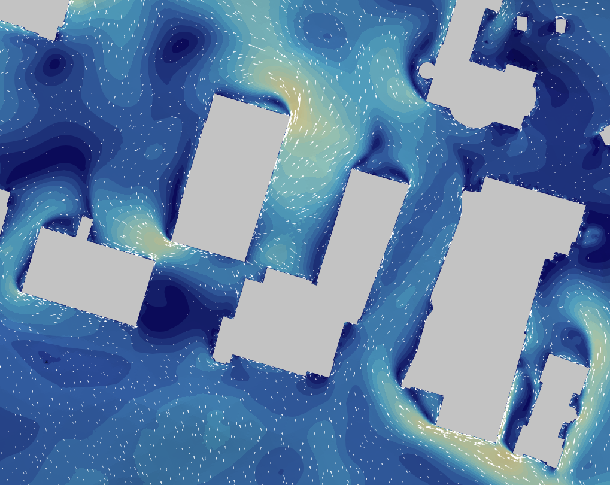

# A Comparison of Wind Velocity Predictions from Wind-Only and Thermally Coupled OpenFOAM Solvers in Urban Models with Complex Terrain

**Author:** Carmem Aires (MSc Geomatics - 3D Geoinformation Group — TU Delft)

This repository belongs to the master thesis [**"Comparison of Wind Velocity Predictions from Wind-Only and Thermally Coupled OpenFOAM Solvers in Urban Models with Complex Terrain"**](https://repository.tudelft.nl/record/uuid:d18b9ec9-a296-47c3-a2d0-92969777369e) presented at the 3D Geoinformation Group of the Delft University of Technology - Faculty of Architecture and the Built Environment.





## Repository structure

This repository contains two case directories and a model-reconstruction directory:

```
repository/
    ├── case_directories/
    |    ├── case_sF/           # simpleFoam case setup
    |    └── case_uMF/          # urbanMicroclimateFoam case setup
    └── model-reconstruction/   # City4CFD reconstruction setup
```

## Requirements

To run the cases you will need the following software (the cases were tested in these software versions and using linux):

- [OpenFOAM v7](https://openfoam.org/)
- [urbanMicroclimateFoam](https://github.com/OpenFOAM-BuildingPhysics/urbanMicroclimateFoam)
- [City4CFD](https://github.com/tudelft3d/city4cfd)


## Running cases and reconstruction

### Running simpleFoam and urbanMicroclimateFoam Cases

**1. Add input data**

Download the .obj files from the [4TU.ResearchData](https://data.4tu.nl/datasets/fbdbda4e-e4e5-46eb-9521-505b6a15889f) repository and add it to the respective triSurface directory
```
casedir/
├── 0/   
└── constant/  
    └── triSurface/   <- add the geometry here
```

**2. Prepare the case:**

```bash
./Allprepare
```

**3. Run the case:**

```bash
./Allrun
```

### Additional utilities for debugging/re-running urbanMicroclimateFoam

The following utilities are included for use with `urbanMicroclimateFoam`:

 `DecomposeNewFields`
Redistributes field files to a decomposed case after changes in the fields.

 `ExportMeshProblems`
Exports mesh errors to VTK format.

 `FaceagglRerun`
Removes files created by a previous `faceAgglomerate` run, redistributes the new `viewFactorsDict`, and reruns `faceAgglomerate`. Useful when `faceAgglomerate` or `viewFactorsGen` crashes.


### Model reconstruction using City4CFD

The 3D models are provided directly, but if you wish to reconstruct them yourself, the `model-reconstruction/` folder contains the configuration file for [City4CFD](https://github.com/tudelft3d/city4cfd). Please note that several manual pre-processing steps were followed after the reconstruction using City4CFD, see the [thesis report](https://repository.tudelft.nl/record/uuid:d18b9ec9-a296-47c3-a2d0-92969777369e), therefore you will probably encounter errors with urbanMicroclimateFoam.

**1. Add input data**

Download the polygons and point clouds from the [4TU.ResearchData](https://data.4tu.nl/datasets/fbdbda4e-e4e5-46eb-9521-505b6a15889f) repository and place it in the following structure:

```
model-reconstruction/
├── polygons/    # Building and Vegetation footprints
└── PC/          # Point clouds
```
**2. Run reconstruction**

Create a `results/` folder in the `model-reconstruction/` directory. Then run from that directory:

```bash
your-City4CFD-folder/build/city4cfd config_small_rectangle.json --output_dir results
```


## How to cite this work

To cite this work please use:

Aires, C. (2026). A Comparison of Wind Velocity Predictions from Wind-Only and Thermally Coupled OpenFOAM Solvers in Urban Models with Complex Terrain. MSc Thesis, Delft University of Technology, Faculty of Architecture and the Built Environment.

Data DOI: 10.4121/fbdbda4e-e4e5-46eb-9521-505b6a15889f.v1